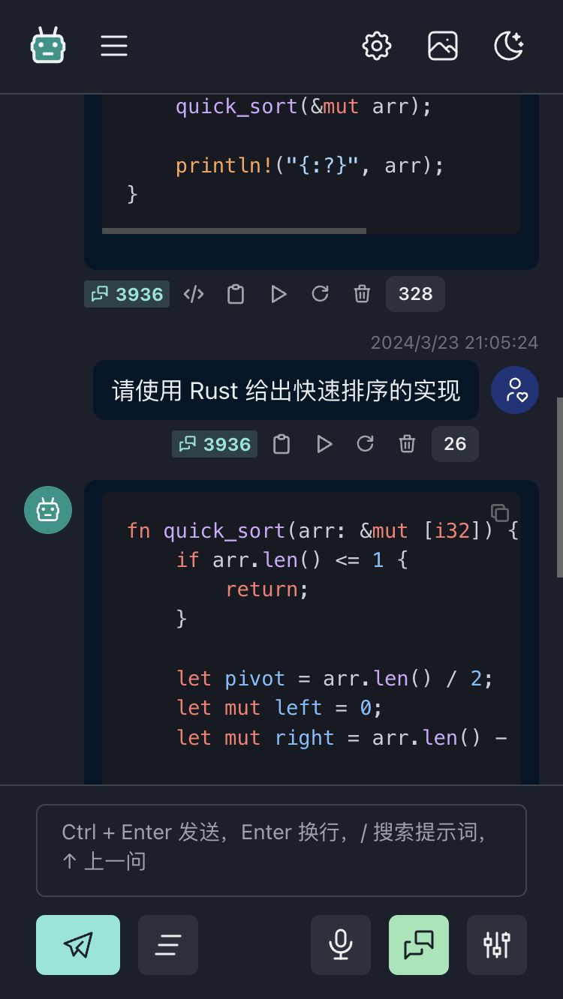
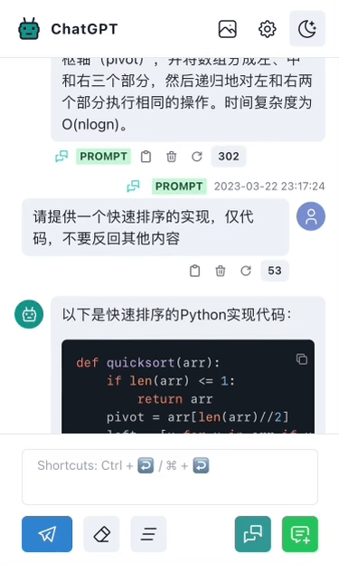

# ChatGPT

## 功能

- 对话使用 OPENAI 官方 API `/v1/chat/completions`
- 支持图片生成 `/v1/images/generations`
- 支持查询 apiKey 余额 `/dashboard/billing/credit_grants`
- 支持设置 System Prompt，提供多个模版供选择
- 支持连续对话
- 消息显示 token 使用数量
- 支持配置模型
- 支持夜间模式
- 支持对话内容复制
- 支持代码复制
- 页面样式移动端优先
- 支持 ASR 和 TTS，可用但不完善，需申请 key，[申请地址](https://ai.unisound.com)

## 使用介绍

- 页面中保存的 OPENAI KEY 会明文保存在 localstorage
- 消息列表以 json 形式保存在 localstorage
- 页面中保存的 API KEY 会明文传输进行请求
- 输入框为空时，按上箭头将填充上一条消息内容

### System Prompt

- 使用 localstorage 保存，仅保存当前使用的值
- 如果 prompt 最后一句带有问句，个人建议将该问句从 prompt 删除，将其填入消息内容框内，不然每次对话的时候，该问句都会跟随 system prompt 一起发送
- 配置 System Prompt 后页面底部的设置按钮会高亮
- 消息和回复底部会显示`PROMPT`的标签，点击会复制并显示该 prompt
- 击消息底部的重试按钮，会恢复对应的 System Prompt 并更新 localstorage 的值
- 有 prompt 时未填写消息内容，可点击发送按钮。因内容为空，为便于查看，列表中内容区域会显示为 System Prompt

### 连续对话

1. 开启后底部按钮高亮，消息会带有 conversionId
2. 每次对话都会从页面消息列表查找对应 conversionId 的消息
3. 发送的消息和回复会带有图标，用来辨别该内容是否为连续对话
4. 连续对话会根据 conversionId 从列表中寻找历史会话消息
5. 点击消息底部的重试按钮，会继续使用对应的 conversionId 延续对话。即使这条消息和历史对话消息中间穿插着对话其他消息
6. 连续对话会添加 token 限制，会保留最低 1000 个 token 给回复使用
7. 取最新的消息，超出 token 限制的历史消息会被舍弃
8. 已添加 gpt-4 token 数判断

## 环境变量

以下是支持的环境变量，非 `PUBLIC_` 开头的环境变量只在 `/pages/api/` 调用

- `OPENAI_API_KEY`
- `OPENAI_API_HOST`
- `OPENAI_API_MODEL`

- `PUBLIC_UNISOUND_AI_KEY`
- `UNISOUND_AI_SECRET`

已知问题：部署在 Vercel 中非 `PUBLIC_` 开头的环境变量在 `/api` 服务端中无法读取。

当前使用的是 `@astrojs/vercel/edge`，但是测试发现 `@astrojs/vercel/serverless` 是正常的，应该是 astrojs 的 bug

临时添加以下环境变量，客户端页面中未读取这些环境变量可放心使用

- `PUBLIC_OPENAI_API_KEY`
- `PUBLIC_OPENAI_API_HOST`
- `PUBLIC_OPENAI_API_MODEL`
- `PUBLIC_UNISOUND_AI_SECRET`

## 感谢

项目创建参考

- [ddiu8081 / chatgpt-demo](https://github.com/ddiu8081/chatgpt-demo)

prompt 模版来自：

- [rockbenben / ChatGPT-Shortcut](https://github.com/rockbenben/ChatGPT-Shortcut)
- [PlexPt / awesome-chatgpt-prompts-zh](https://github.com/PlexPt/awesome-chatgpt-prompts-zh)
- [f/awesome-chatgpt-prompts](https://github.com/f/awesome-chatgpt-prompts)
- [timqian/openprompt.co](https://github.com/timqian/openprompt.co)
- [GaiZhenbiao / ChuanhuChatGPT](https://github.com/GaiZhenbiao/ChuanhuChatGPT)

依赖库

- astro
- react
- chakra-ui
- tabler icon
- nanostores
- unocss
- markdown-it
- github-markdown-css
- ahooks
- gpt3-tokenizer
