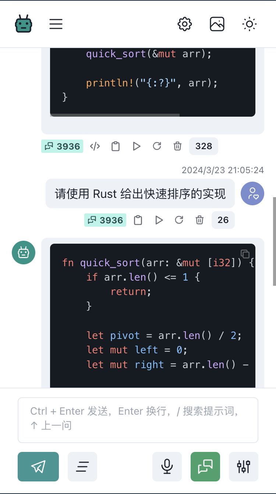

# ChatGPT

## 功能介绍

- 支持 ASR 和 TTS，可用但不完善，需申请 key，[申请地址](https://ai.unisound.com)
- 对话使用 OPENAI 官方 API `/v1/chat/completions`
- 支持图片生成 `/v1/images/generations`
- 查询 apiKey 余额 `/dashboard/billing/credit_grants`
- 支持设置 system prompt，提供多个模版供选择
- 支持连续对话
- 消息显示 token 使用数量
- 支持配置模型
- 支持夜间模式
- 支持代码复制
- 支持对话内容复制
- 页面样式移动端优先

## 使用介绍

### 存储

- 页面中保存的 API KEY 会明文保存在 localstorage
- 消息列表以 json 形式保存在 localstorage
- 如果未配置环境变量，页面中保存的 API KEY 会明文传输进行请求

### System Prompt

- 使用 localstorage 保存，仅保存一个值
- 如果 prompt 最后一句带有问句，个人建议将该问句从 prompt 删除，将其填入消息内容框内，不然每次对话的时候，该问句都会跟随 system prompt 一起发送
- 如果已配置 System Prompt
  1. 页面底部的设置按钮会高亮
  2. 消息和回复如果带有 prompt，会显示`PROMPT`的文本标签，点击会复制并显示该 prompt
  3. 点击消息底部的重试按钮会直接更新 localstorage 的值，因为只保存了一份缓存
  4. 有 prompt 时没有填写消息内容，可以点击发送按钮，便于查看消息列表中内容区域会显示为 prompt 而不是内容

### 连续对话

1. 底部对应的按钮高亮，代表开启
2. 开启后消息会带有 conversionId，会和上面的消息隔离开
3. 开启后，发送的消息和回复会带有标签用来辨别该内容是否为连续对话
4. 如果连续对话关闭后，点击列表内消息的重试按钮，仍会继续该对话
5. 连续对话会根据 conversionId 从消息列表中寻找历史消息，不依赖后端，如果页面中删除消息，将无法组成完整的对话
6. 连续对话会添加 token 限制，取最新的消息，并且最大占用 3000 个 token，留下 1000 个给回复使用，超出 token 限制的消息会被舍弃

### 其他

- 输入框为空时，按上箭头填充上一条消息内容

## 环境变量

- `OPENAI_API_KEY`
- `OPENAI_API_HOST`
- `OPENAI_API_MODEL`

- `UNISOUND_AI_KEY`
- `UNISOUND_AI_SECRET`

## 感谢

项目创建参考

- [ddiu8081 / chatgpt-demo](https://github.com/ddiu8081/chatgpt-demo)

prompt 模版来自：

- [rockbenben / ChatGPT-Shortcut](https://github.com/rockbenben/ChatGPT-Shortcut)
- [PlexPt / awesome-chatgpt-prompts-zh](https://github.com/PlexPt/awesome-chatgpt-prompts-zh)
- [f/awesome-chatgpt-prompts](https://github.com/f/awesome-chatgpt-prompts)
- [GaiZhenbiao / ChuanhuChatGPT](https://github.com/GaiZhenbiao/ChuanhuChatGPT)

## 依赖库

- Astro
- React
- Chakra-ui
- Tabler icon
- @nanostores
- Unocss
- markdown-it
- gpt3-tokenizer

## Screenshot

